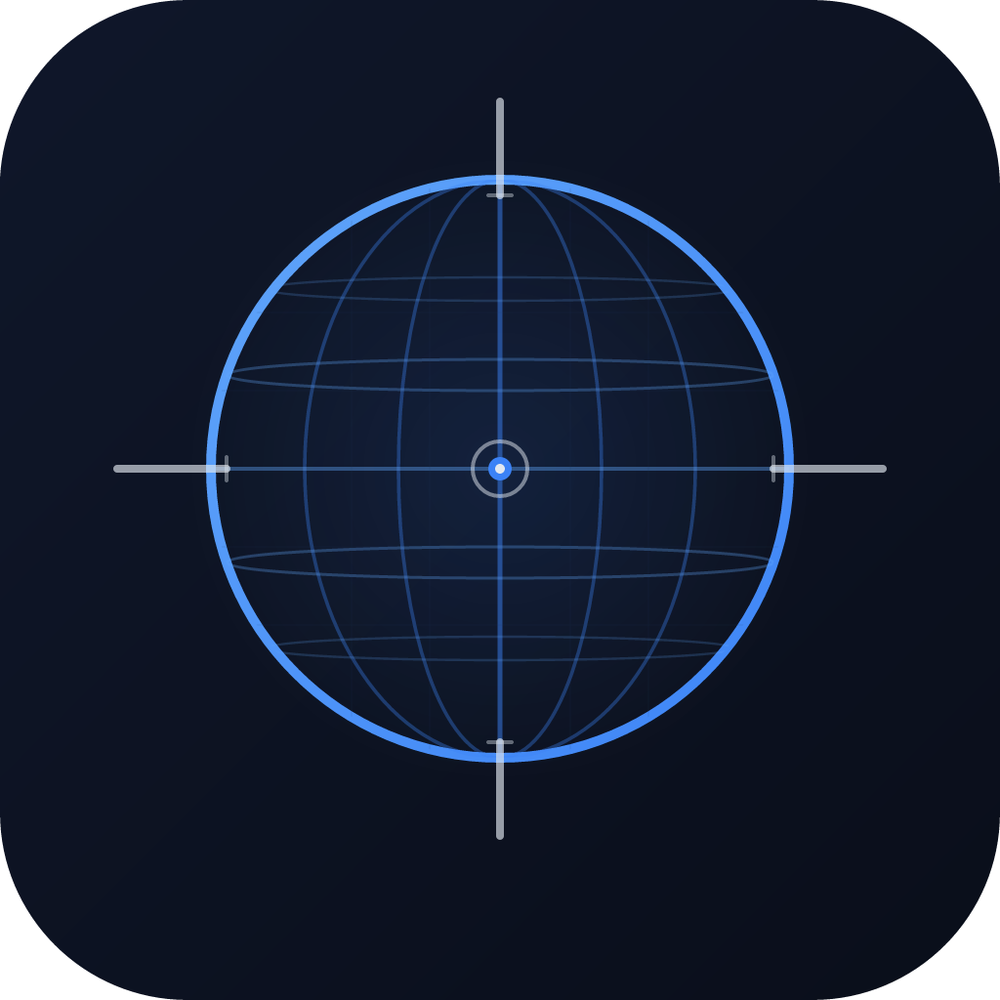

<p align="center">
  
</p>

<h1 align="center">Unlocoder</h1>

<p align="center">
  Precision coordinate conversion and UN/LOCODE timezone API.<br/>
  Convert between DD, DMS, UTM, MGRS, and Plus Code instantly.
</p>

<p align="center">
  <a href="https://unlocoder.com">Web App</a> &middot;
  <a href="https://rapidapi.com/contactliamnoonan/api/unlocoder">API on RapidAPI</a> &middot;
  <a href="#mcp-model-context-protocol">MCP</a> &middot;
  <a href="#quickstart">Quickstart</a> &middot;
  <a href="#api-reference">API Reference</a>
</p>

---

## What is Unlocoder?

Unlocoder is a coordinate conversion tool and UN/LOCODE lookup API. Paste any coordinate format and get every other format back instantly.

**Web converter** &mdash; free, no sign-up, no ads: [unlocoder.com](https://unlocoder.com)

**REST API** &mdash; programmatic access via [RapidAPI](https://rapidapi.com/contactliamnoonan/api/unlocoder)

**MCP Server** &mdash; give AI agents coordinate conversion and UN/LOCODE lookup capabilities, available via [RapidAPI MCP](https://rapidapi.com/contactliamnoonan/api/unlocoder)

### Supported Formats

| Format | Example |
|--------|---------|
| Decimal Degrees (DD) | `51.5074, -0.1278` |
| Degrees Minutes Seconds (DMS) | `51°30'26.64"N 0°7'40.08"W` |
| Degrees Decimal Minutes (DDM) | `51°30.444'N 0°7.668'W` |
| Universal Transverse Mercator (UTM) | `30U 699375 5710099` |
| Military Grid Reference (MGRS) | `30UXC9937510099` |
| Google Plus Codes | `9C3XGV4C+HQ` |
| UN/LOCODE | `GBLON` |

### Key Features

- **Auto-detection** &mdash; paste any format, the system identifies it
- **Configurable precision** &mdash; 4 to 10 decimal places
- **UN/LOCODE enrichment** &mdash; timezone, UTC offset, local time, elevation, and nearby locations
- **Nearby UN/LOCODE search** &mdash; find the closest ports/locations to any coordinate
- **Sub-100ms responses** &mdash; aggressive caching, optimised queries
- **MCP support** &mdash; connect AI agents (Claude, GPT, etc.) to Unlocoder as a tool via the Model Context Protocol

---

## MCP (Model Context Protocol)

Unlocoder is available as an MCP server through [RapidAPI](https://rapidapi.com/contactliamnoonan/api/unlocoder), letting AI agents use coordinate conversion and UN/LOCODE lookups as tools.

This means AI assistants can:
- Convert coordinates between formats during conversations
- Look up UN/LOCODE timezones and locations on the fly
- Find the nearest ports or logistics hubs to a given position

To connect, add Unlocoder as an MCP tool via the RapidAPI hub in your agent's configuration. No additional setup required.

---

## Quickstart

### 1. Get an API Key

Sign up for a free key on [RapidAPI](https://rapidapi.com/contactliamnoonan/api/unlocoder). The free tier includes 500 requests/month.

### 2. Make Your First Call

```bash
curl -X POST "https://unlocoder.p.rapidapi.com/api/convert" \
  -H "Content-Type: application/json" \
  -H "x-rapidapi-key: YOUR_API_KEY" \
  -H "x-rapidapi-host: unlocoder.p.rapidapi.com" \
  -d '{"input": "51.5074, -0.1278"}'
```

### 3. Get Results

```json
{
  "latitude": 51.5074,
  "longitude": -0.1278,
  "detectedFormat": "DecimalDegrees",
  "precision": 6,
  "outputs": {
    "DecimalDegrees": "51.507400, -0.127800",
    "DegreesMinutesSeconds": "51°30'26.64\"N 0°7'40.08\"W",
    "DegreesDecimalMinutes": "51°30.444'N 0°7.668'W",
    "Utm": "30U 699375 5710099",
    "Mgrs": "30UXC9937510099",
    "PlusCode": "9C3XGV4C+HQ"
  },
  "nearbyUnLocodes": [
    { "code": "GBLON", "name": "London", "distanceKm": 1.2 }
  ]
}
```

---

## API Reference

### Convert Coordinates

Convert any coordinate format to all other formats with auto-detection.

```
POST /api/convert
```

| Field | Type | Required | Description |
|-------|------|----------|-------------|
| `input` | string | Yes | Any supported coordinate format |
| `precision` | integer | No | Decimal places, 4-10 (default: 6) |

**Response fields:**

| Field | Description |
|-------|-------------|
| `latitude` / `longitude` | Parsed coordinates |
| `detectedFormat` | Which format was detected |
| `outputs` | All converted formats |
| `location` | UN/LOCODE enrichment (if input was a UN/LOCODE) |
| `nearbyUnLocodes` | Up to 3 nearest UN/LOCODEs within 5000km |

### Lookup UN/LOCODE

Get timezone, coordinates, and metadata for a UN/LOCODE.

```
GET /unlocodes/{code}
```

| Parameter | Type | Description |
|-----------|------|-------------|
| `code` | path | UN/LOCODE, e.g. `GBLON` or `GB LON` |
| `referenceTime` | query | Optional ISO 8601 datetime for historical timezone offset |

**Response includes:** country, location name, subdivision, coordinates, timezone ID, UTC offset, local time, confidence score, and enrichment timestamp.

### Find Nearby UN/LOCODEs

Find the closest UN/LOCODEs to a coordinate pair.

```
GET /unlocodes/nearby?latitude={lat}&longitude={lng}
```

Returns up to 3 results within a 5000km radius, sorted by distance.

---

## Examples

Full working examples in multiple languages:

| Language | File |
|----------|------|
| curl | [`examples/curl.sh`](examples/curl.sh) |
| Python | [`examples/python_example.py`](examples/python_example.py) |
| JavaScript | [`examples/javascript_example.js`](examples/javascript_example.js) |
| Go | [`examples/go_example.go`](examples/go_example.go) |

---

## Pricing

| Tier | Price | Requests/Month | Rate Limit |
|------|-------|----------------|------------|
| Basic | Free | 500 | 60 req/min |
| Pro | $9/mo | 2,500 | 10 req/sec |
| Enterprise | Custom | Custom | Custom |

The web converter at [unlocoder.com](https://unlocoder.com) is always free with no limits.

---

## Links

- [Web App](https://unlocoder.com)
- [API & MCP on RapidAPI](https://rapidapi.com/contactliamnoonan/api/unlocoder)
- [Report an Issue](../../issues)

---

<p align="center">&copy; 2025 Unlocoder</p>
